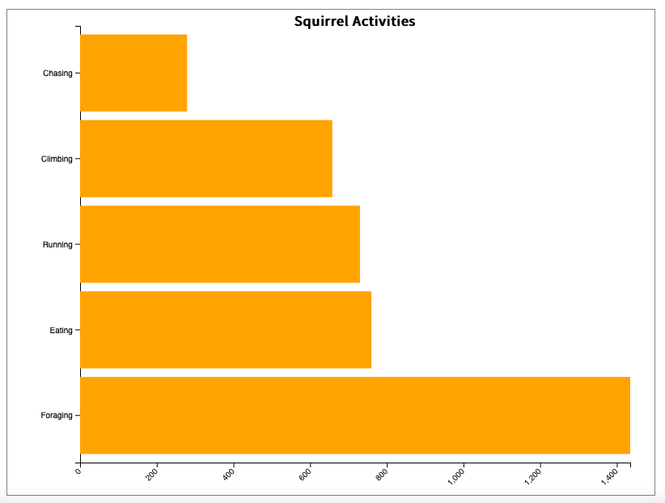
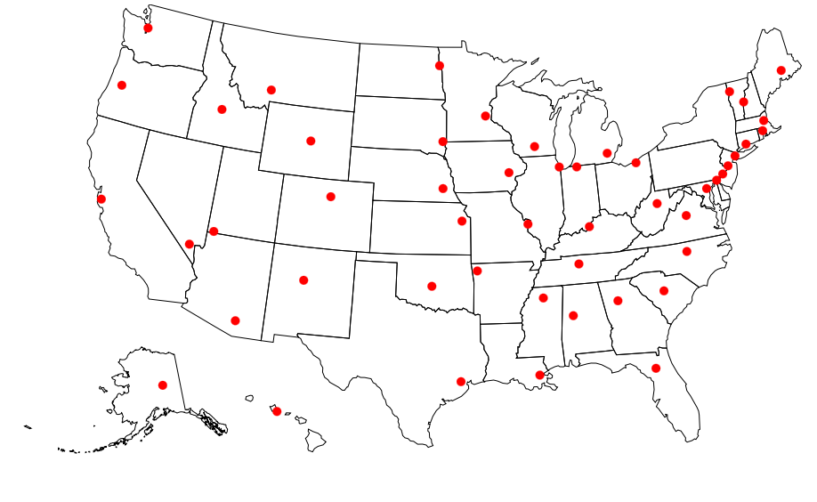
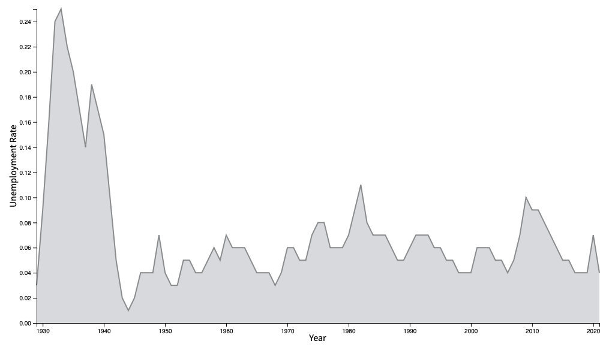
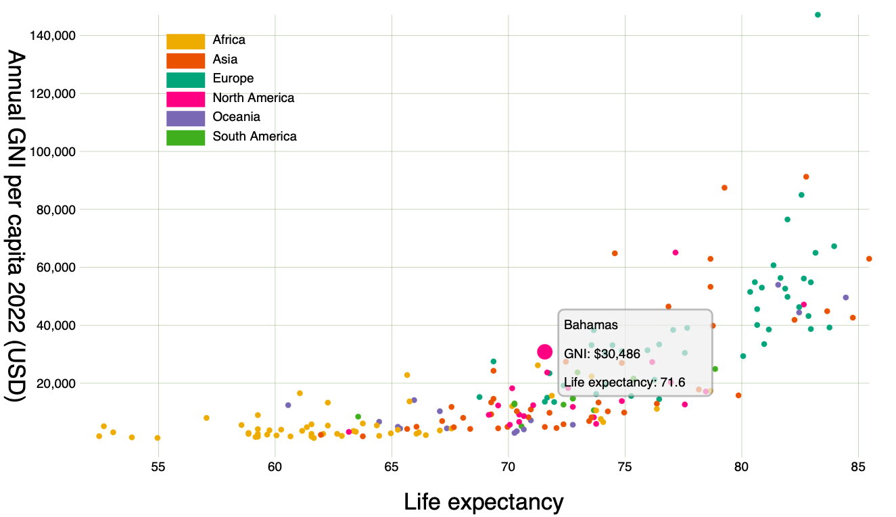
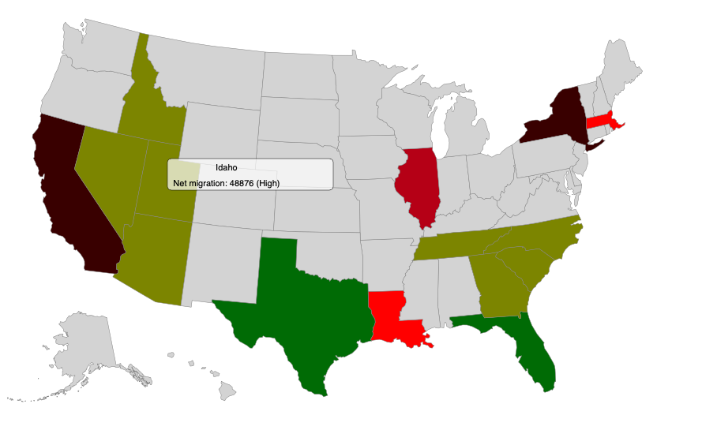
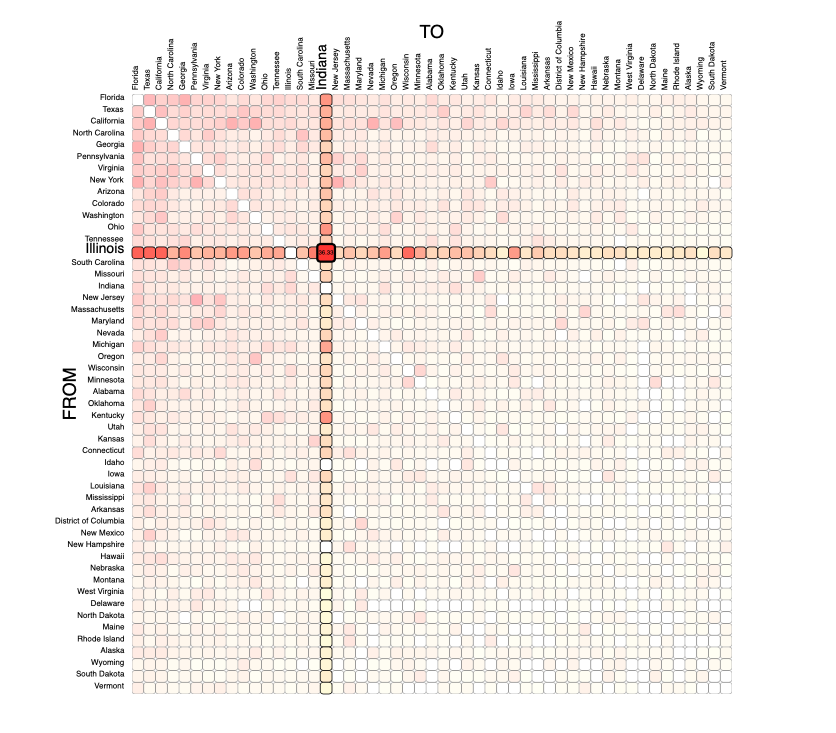

# DATA VIS PORTFOLIO

This is my portfolio of few visualizations I prepared for Interactive Data Visualization course at CUNY Graduate Center.
 

## SIMPLE VISUALIZATIONS

**MY FIRST D3.js VIS - HORIZONTAL BARCHART** Data: [The Squirrel Census](https://www.thesquirrelcensus.com)

(https://agilarowski.github.io/Interactive-Data-Vis-Fall2022/Portfolio/Bar/index.html)

 

**FIRST MAP - Top ranked university in each state.** Data: [Top Universities](https://www.topuniversities.com/university-rankings-articles/world-university-rankings/top-us-universities-state-2020)

 

(https://agilarowski.github.io/Interactive-Data-Vis-Fall2022/Portfolio/Map/index.html)

 

**SIMPLE AREA CHART** Data: [The Balance](https://www.thebalancemoney.com/unemployment-rate-by-year-3305506)

(https://agilarowski.github.io/Interactive-Data-Vis-Fall2022/Portfolio/Area/index.html)

 

## INTERACTIVE VISUALIZATIONS

**SCATTERPLOT** Data: [Human Development Reports](https://hdr.undp.org/data-center/human-development-index#/indicies/HDI)

(https://agilarowski.github.io/Interactive-Data-Vis-Fall2022/Portfolio/Scatterplot/index.html)
 
 

**STATE NET MIGRATION MAP** Data: [US Census Bureau, State-to-State Migration Flows, 2019](https://www.census.gov/data/tables/time-series/demo/geographic-mobility/state-to-state-migration.html)

(https://agilarowski.github.io/Interactive-Data-Vis-Fall2022/Portfolio/Migration_Map/index.html)

 

**MIGRATION MATRIX** Data: [US Census Bureau, State-to-State Migration Flows, 2019](https://www.census.gov/data/tables/time-series/demo/geographic-mobility/state-to-state-migration.html)
(https://agilarowski.github.io/Interactive-Data-Vis-Fall2022/Portfolio/Migration_Matrix/index.html)

The last two visualizations I prepared for my final project. Here is the [FINAL PROJECT PLAN](https://github.com/agilarowski/Interactive-Data-Vis-Fall2022/blob/main/Portfolio/FinalProject.md)

[REFLECTION](https://github.com/agilarowski/Interactive-Data-Vis-Fall2022/blob/main/Portfolio/Conclusion.md)
