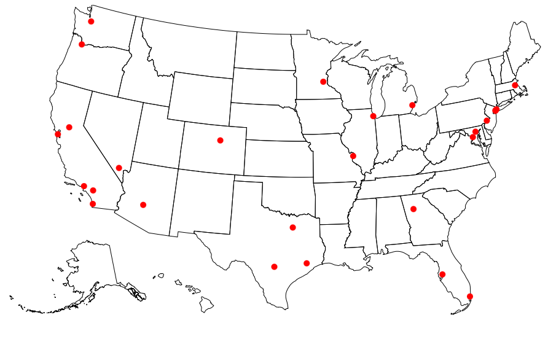

# DATA VIS PORTFOLIO

This is my portfolio of few visualizations I prepared for Interactive Data Visualization course at CUNY Graduate Center.
 

## SIMPLE VISUALIZATIONS

**MY FIRST D3.js VIS - HORIZONTAL BARCHART**

(https://agilarowski.github.io/Interactive-Data-Vis-Fall2022/Portfolio/Bar/index.html)

 

**FIRST MAP - Top ranked university in each state.**

 

(https://agilarowski.github.io/Interactive-Data-Vis-Fall2022/Portfolio/Map/index.html)

 

**SIMPLE AREA CHART - Unemployment over time.**

(https://agilarowski.github.io/Interactive-Data-Vis-Fall2022/Portfolio/Area/index.html)

 

## INTERACTIVE VISUALIZATIONS

**SCATTERPLOT** Data: United Nations, HDI 2022.

(https://agilarowski.github.io/Interactive-Data-Vis-Fall2022/Portfolio/Scatterplot/index.html)
 
 

**STATE NET MIGRATION MAP** US Census Bureau, State-to-State Migration Flows, 2019.

(https://agilarowski.github.io/Interactive-Data-Vis-Fall2022/Portfolio/Migration_Map/index.html)
